<!-- hero: monochrome ASCII portrait and 3d ascii wordmark -->
<h3><code>shivam@github ~ $ whoami</code></h3>

<table>
<tr>
<td valign="top"></td>
<td valign="top"></td>
</tr>
</table>

 
 

<!-- animated contribution graph -->

 
 

<b>Computer Science Engineering Student</b>

 

